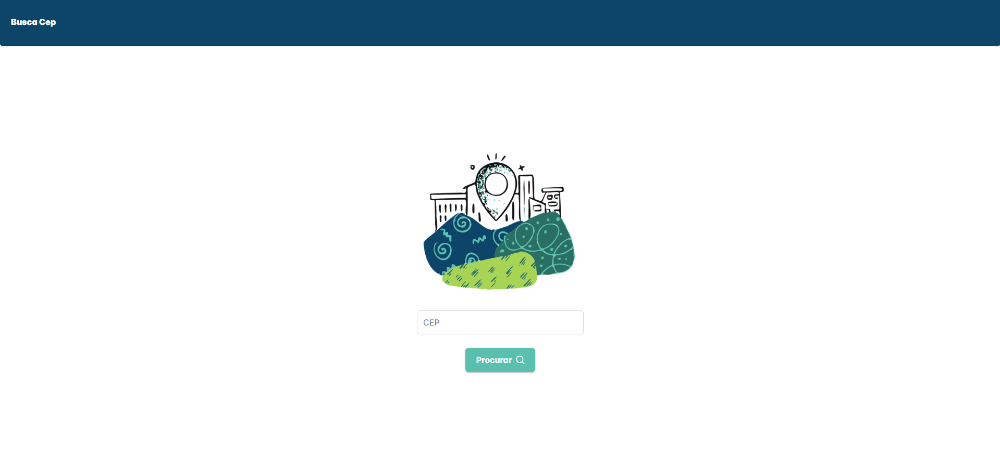
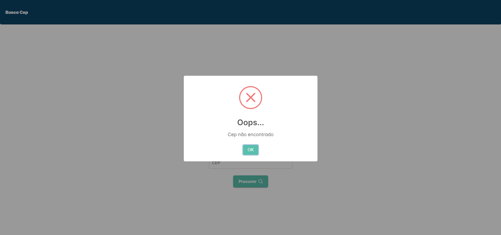
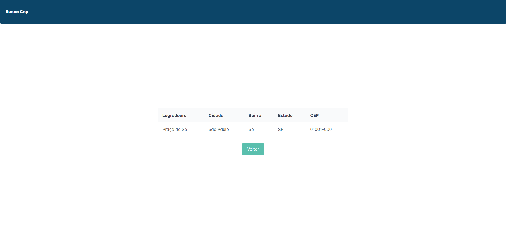

# BuscaCEP

Este projeto Angular se trata de uma conexão com a api [viacep.com.br](https://viacep.com.br/) que permite com que o usuário faça consulta de CEP's retornando além do cep digitado informações como Rua, Bairro, Cidade e Estado.

## Página de consulta

A página de consulta é bem simples possuindo somente o input do cep e o botão de pesquisa

Porém existem condições para que se efetue com sucesso a busca, sendo a primeira delas quando não o número exato de caracteres de um CEP _(8 dígitos)_, caso seja menor a aplicação não prossegue para a próxima página. O mesmo ocorre quando o número do CEP não existe é mostrado um modal informando que o CEP não foi encontrado

## Resultado da consulta

O resultado da consulta mostra apenas uma tabela com os dados do CEP digitado e o botão que retorna para a página inicial

### Conceitos utilizados na aplicação
- Services
- Routes
- Regex
- Directives
- Interfaces
- Clean Architeture

## Angular Version
This project was generated with [Angular CLI](https://github.com/angular/angular-cli) version 17.0.7.

## Development server

Run `ng serve` for a dev server. Navigate to `http://localhost:4200/`. The application will automatically reload if you change any of the source files.

## Code scaffolding

Run `ng generate component component-name` to generate a new component. You can also use `ng generate directive|pipe|service|class|guard|interface|enum|module`.

## Build

Run `ng build` to build the project. The build artifacts will be stored in the `dist/` directory.

## Running unit tests

Run `ng test` to execute the unit tests via [Karma](https://karma-runner.github.io).

## Running end-to-end tests

Run `ng e2e` to execute the end-to-end tests via a platform of your choice. To use this command, you need to first add a package that implements end-to-end testing capabilities.

## Further help

To get more help on the Angular CLI use `ng help` or go check out the [Angular CLI Overview and Command Reference](https://angular.io/cli) page.
